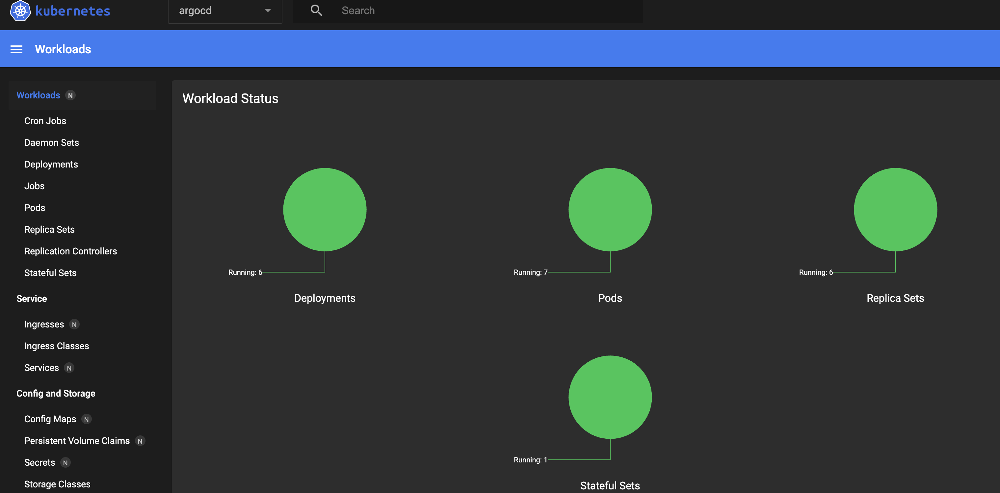
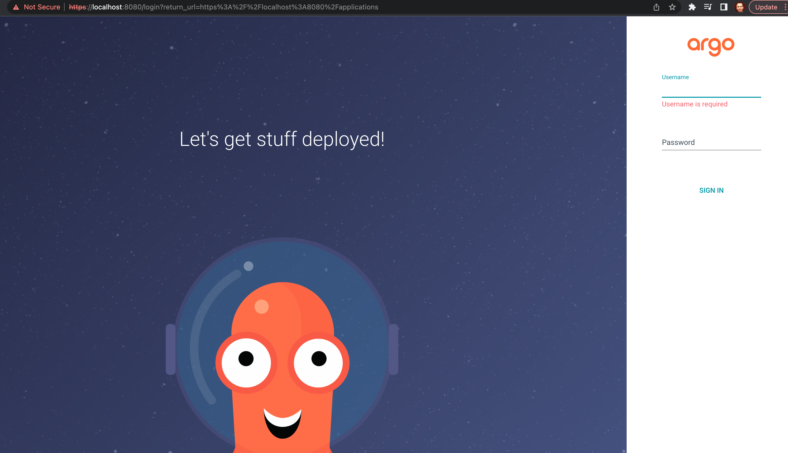
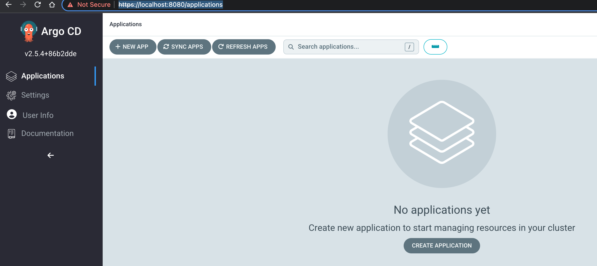
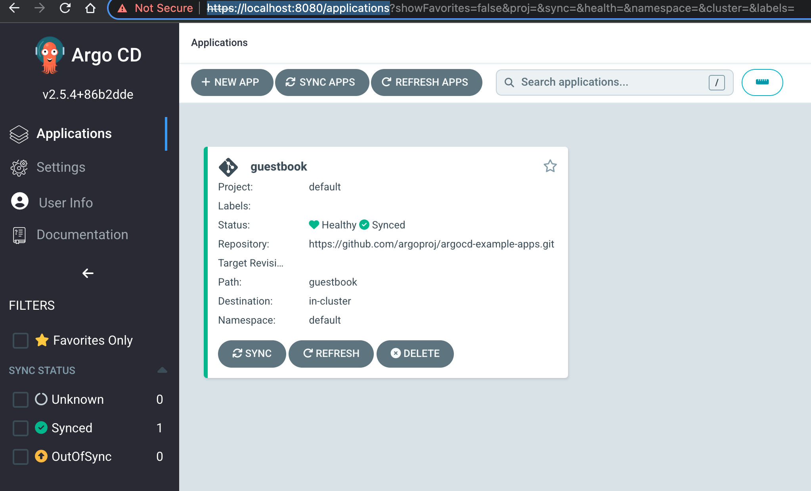
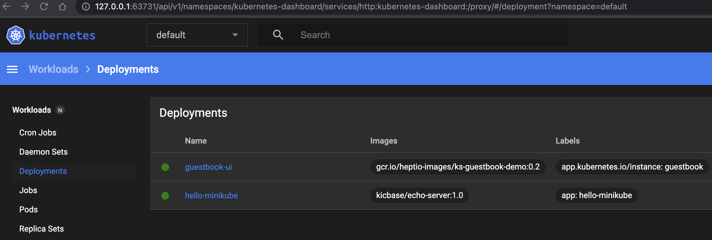
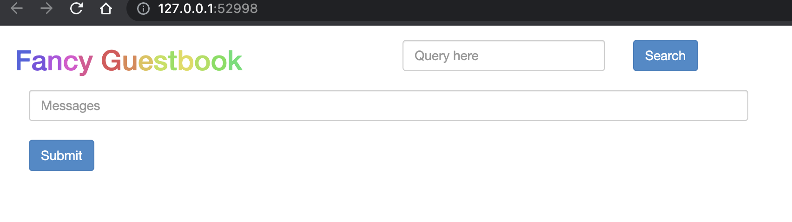
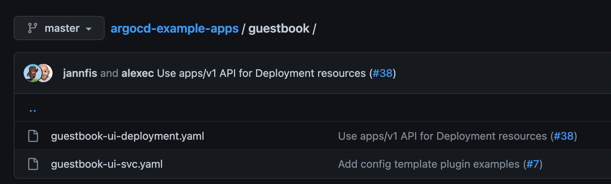
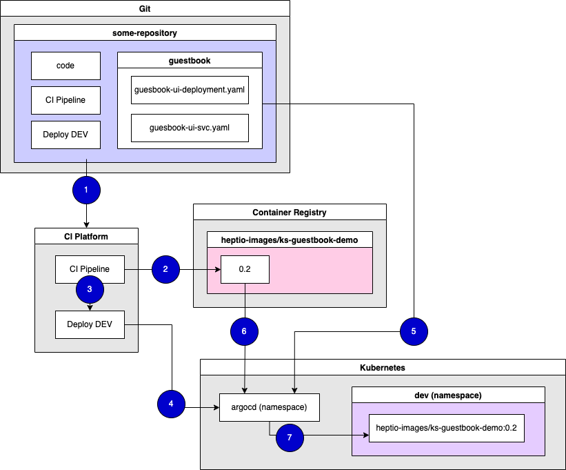

# ArgoCD

> ArgoCD is **a declarative GitOps tool built to deploy applications to Kubernetes**. While the continuous delivery (CD) space is seen by some as crowded these days, ArgoCD does bring some interesting capabilities to the table. Unlike other tools, ArgoCD is lightweight and easy to configure.

- https://tanzu.vmware.com/developer/guides/argocd-gs/

Prerequisites

- Git: https://github.com/jvalentino/setup-git
- Docker and Docker Compose: https://github.com/jvalentino/setup-docker
- Kubernetes: https://github.com/jvalentino/setup-kubernetes


# (1) Install

```bash
kubectl create namespace argocd
kubectl apply -n argocd -f https://raw.githubusercontent.com/argoproj/argo-cd/stable/manifests/install.yaml
```

If you are running `minikube dashboard` in another shell, you will be able to see this new namespace come up in the browser:



# (2) Argo CD CLI

If you are not on Mac see, https://github.com/argoproj/argo-cd/releases/latest

Otherwise, just use Homebrew:

```bash
brew install argocd
```

# (3) ArgoCD API server setup

By default, the Argo CD API server is not exposed with an external IP. To access the API server, choose one of the following techniques to expose the Argo CD API server.

Change the argocd-server service type to `LoadBalancer`:

```bash
$ kubectl patch svc argocd-server -n argocd -p '{"spec": {"type": "LoadBalancer"}}'

service/argocd-server patched
```

You have then then run another shell and leave this open to get to the website:

```bash
kubectl port-forward svc/argocd-server -n argocd 8080:443
```



# (4) Login using the CLI

The initial password for the `admin` account is auto-generated and stored as clear text in the field `password` in a secret named `argocd-initial-admin-secret` in your Argo CD installation namespace. You can simply retrieve this password using `kubectl`:

```bash
$ kubectl -n argocd get secret argocd-initial-admin-secret -o jsonpath="{.data.password}" | base64 -d; echo

yMt4MAUgkqTlKNiI
```

Now it is time to finally login:

```bash
$ argocd login localhost:8080

WARNING: server certificate had error: x509: “Argo CD” certificate is not trusted. Proceed insecurely (y/n)? y
Username: admin
Password: 
'admin:login' logged in successfully
Context 'localhost:8080' updated
```

You can now though finally change the password to something else though:

```bash
$ argocd account update-password

*** Enter password of currently logged in user (admin): 
*** Enter new password for user admin: 
*** Confirm new password for user admin: 
Password updated
Context 'localhost:8080' updated
```

Consider that from a CLI perspective, such as your Github Action, it will be doing a login to be able to run the later operations

You can also then login via the UI as well: https://localhost:8080/applications



# (5) Deploying apps via the CLI

First we need to set the current namespace to argocd running the following command:

```bash
kubectl config set-context --current --namespace=argocd
```

Create the example guestbook application with the following command:

```bash
argocd app create guestbook \
	--repo https://github.com/argoproj/argocd-example-apps.git \
	--path guestbook \
	--dest-server https://kubernetes.default.svc \
	--dest-namespace default
```

Once the guestbook application is created, you can now view its status:

```bash
$ argocd app get guestbook

Name:               argocd/guestbook
Project:            default
Server:             https://kubernetes.default.svc
Namespace:          default
URL:                https://localhost:8080/applications/guestbook
Repo:               https://github.com/argoproj/argocd-example-apps.git
Target:             
Path:               guestbook
SyncWindow:         Sync Allowed
Sync Policy:        <none>
Sync Status:        OutOfSync from  (53e28ff)
Health Status:      Missing

GROUP  KIND        NAMESPACE  NAME          STATUS     HEALTH   HOOK  MESSAGE
       Service     default    guestbook-ui  OutOfSync  Missing        
apps   Deployment  default    guestbook-ui  OutOfSync  Missing    
```

The application status is initially in `OutOfSync` state since the application has yet to be deployed, and no Kubernetes resources have been created. To sync (deploy) the application, run:

```bash
$ argocd app sync guestbook

TIMESTAMP                  GROUP        KIND   NAMESPACE                  NAME    STATUS    HEALTH        HOOK  MESSAGE
2022-XX-YYT13:03:37-06:00   apps  Deployment     default          guestbook-ui  OutOfSync  Missing              
2022-XX-YYT13:03:37-06:00            Service     default          guestbook-ui  OutOfSync  Missing              
2022-XX-YYT13:03:37-06:00            Service     default          guestbook-ui  OutOfSync  Missing              service/guestbook-ui created
2022-XX-YYT13:03:37-06:00   apps  Deployment     default          guestbook-ui  OutOfSync  Missing              deployment.apps/guestbook-ui created
2022-XX-YYT13:03:37-06:00            Service     default          guestbook-ui    Synced  Healthy                  service/guestbook-ui created
2022-XX-YYT13:03:37-06:00   apps  Deployment     default          guestbook-ui    Synced  Progressing              deployment.apps/guestbook-ui created

Name:               argocd/guestbook
Project:            default
Server:             https://kubernetes.default.svc
Namespace:          default
URL:                https://localhost:8080/applications/guestbook
Repo:               https://github.com/argoproj/argocd-example-apps.git
Target:             
Path:               guestbook
SyncWindow:         Sync Allowed
Sync Policy:        <none>
Sync Status:        Synced to  (53e28ff)
Health Status:      Progressing

Operation:          Sync
Sync Revision:      53e28ff20cc530b9ada2173fbbd64d48338583ba
Phase:              Succeeded
Start:              2022-XX-YY 13:03:36 -0600 CST
Finished:           2022-XX-YY 13:03:37 -0600 CST
Duration:           1s
Message:            successfully synced (all tasks run)

GROUP  KIND        NAMESPACE  NAME          STATUS  HEALTH       HOOK  MESSAGE
       Service     default    guestbook-ui  Synced  Healthy            service/guestbook-ui created
apps   Deployment  default    guestbook-ui  Synced  Progressing        deployment.apps/guestbook-ui created
```

You can then see the application on https://localhost:8080/applications:



...and additionally via the `minikube dashboard`:



You can then get to the appplication via the following:

```bash
$ minikube service guestbook-ui
|-----------|--------------|-------------|--------------|
| NAMESPACE |     NAME     | TARGET PORT |     URL      |
|-----------|--------------|-------------|--------------|
| default   | guestbook-ui |             | No node port |
|-----------|--------------|-------------|--------------|
😿  service default/guestbook-ui has no node port
🏃  Starting tunnel for service guestbook-ui.
|-----------|--------------|-------------|------------------------|
| NAMESPACE |     NAME     | TARGET PORT |          URL           |
|-----------|--------------|-------------|------------------------|
| default   | guestbook-ui |             | http://127.0.0.1:52998 |
|-----------|--------------|-------------|------------------------|
🎉  Opening service default/guestbook-ui in default browser...
❗  Because you are using a Docker driver on darwin, the terminal needs to be open to run it.
```



# (6) Understanding how this works

Consider that when you are doing a deployment we are running a command like this:

```bash
argocd app create guestbook \
	--repo https://github.com/argoproj/argocd-example-apps.git \
	--path guestbook \
	--dest-server https://kubernetes.default.svc \
	--dest-namespace default
```

...which is specifically pointing to a location on a Git repo, in this case https://github.com/argoproj/argocd-example-apps/tree/master/guestbook:



## **guestbook-ui-deployment.yaml**

```yaml

apiVersion: apps/v1
kind: Deployment
metadata:
  name: guestbook-ui
spec:
  replicas: 1
  revisionHistoryLimit: 3
  selector:
    matchLabels:
      app: guestbook-ui
  template:
    metadata:
      labels:
        app: guestbook-ui
    spec:
      containers:
      - image: gcr.io/heptio-images/ks-guestbook-demo:0.2
        name: guestbook-ui
        ports:
        - containerPort: 80
```

This is the specification telling us what specific image we are deploying (and from where), and then how to run it. You can also see with replicas we are speciying the instance count. Specifically:

> A *Deployment* provides declarative updates for [Pods](https://kubernetes.io/docs/concepts/workloads/pods/) and [ReplicaSets](https://kubernetes.io/docs/concepts/workloads/controllers/replicaset/).
>
> You describe a *desired state* in a Deployment, and the Deployment [Controller](https://kubernetes.io/docs/concepts/architecture/controller/) changes the actual state to the desired state at a controlled rate. You can define Deployments to create new ReplicaSets, or to remove existing Deployments and adopt all their resources with new Deployments.

- https://kubernetes.io/docs/concepts/workloads/controllers/deployment/

## **guestbook-ui-svc.yaml**

```yaml
apiVersion: v1
kind: Service
metadata:
  name: guestbook-ui
spec:
  ports:
  - port: 80
    targetPort: 80
  selector:
    app: guestbook-ui
```

This is the Service specification:

> In Kubernetes, a Service is an abstraction which defines a logical set of Pods and a policy by which to access them (sometimes this pattern is called a micro-service). The set of Pods targeted by a Service is usually determined by a [selector](https://kubernetes.io/docs/concepts/overview/working-with-objects/labels/). To learn about other ways to define Service endpoints, see [Services *without* selectors](https://kubernetes.io/docs/concepts/services-networking/service/#services-without-selectors).
>
> For example, consider a stateless image-processing backend which is running with 3 replicas. Those replicas are fungible—frontends do not care which backend they use. While the actual Pods that compose the backend set may change, the frontend clients should not need to be aware of that, nor should they need to keep track of the set of backends themselves.

- https://kubernetes.io/docs/concepts/services-networking/service/

## Bring it all together



1. It starts with the codebase for the underlying application existing in source control, in this case Git. That codebase specific has everything in it, from the pipelines as code to the Kubernetes configuration. What triggers the process is a change to source control, trigge the CI Pipeline
2. The CI Pipeline is what when triggers checks and tests the code pase, and ultimatley pushed an image to a container reigstry as a new version.
3. The CI Pipeline when initiate the deployment to the first environment, which we will call DEV.
4. The Deploy DEV Pipeline is what makes use of the ArgoCD command-line tool, in order to initiate deployment of what was just published
5. Argo pulls the deployment instructions for Git, which in this case are back in the same Git repository
6. Argo then pulls the image from the container registry
7. Argo then deploys image as a pod to the dev namespace on Kubernetes

The theory here is that you are using different k8s namespaces for different environment, and deployment works by just deploying the appropriate published image to the appropriate environment. If DEV has version 0.2, then only version 0.2 can be deployed to the next environment. This process then works for any application:

- Every application is a repository
- Every repository change results in a new published container image version
- image versions are deployed per environment order

# References

- https://argo-cd.readthedocs.io/en/stable/getting_started/